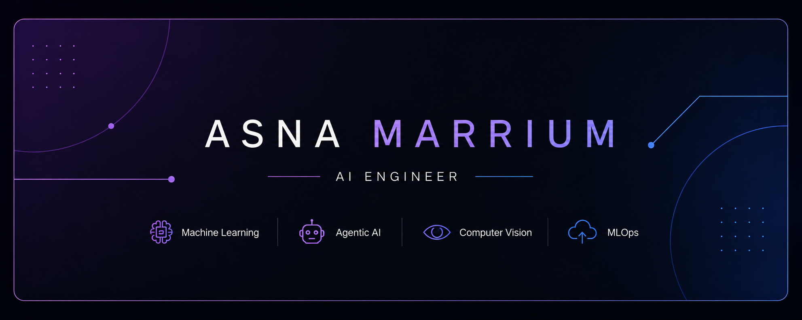

<!-- ===================== HEADER BANNER ===================== -->

<p align="center">
  
</p>


<!-- ===================== INTRO ===================== -->

<h1 align="center">Hi, I'm Asna Marrium 👋</h1>

<p align="center">
  <b>AI Engineer building intelligent systems and practical AI solutions.</b>
</p>

<p align="center">
  Machine Learning • Agentic AI • Computer Vision • MLOps
</p>


<!-- ===================== ABOUT ===================== -->

## About Me

I am an AI Engineer with a background in Computer Science and hands-on experience
building Machine Learning, Deep Learning and AI-powered applications.

My work focuses on developing intelligent systems—from model development and
experimentation to API integration, deployment and scalable AI applications.

I am particularly interested in:

- 🤖 Machine Learning & Deep Learning
- 🧠 Agentic AI & Intelligent Systems
- 👁️ Computer Vision
- ⚙️ MLOps & AI Deployment

Currently focused on building practical AI systems that solve real-world problems.


<!-- ===================== WHAT I DO ===================== -->

## What I Work With

<table>
<tr>
<td width="50%" valign="top">

### 🤖 Machine Learning

Building and optimizing Machine Learning and Deep Learning models for
classification, prediction and real-world AI applications.

**Focus:**

Python • Scikit-learn • PyTorch • TensorFlow

</td>

<td width="50%" valign="top">

### 🧠 Agentic AI

Designing intelligent AI workflows using LLMs, RAG,
tool-using agents and multi-agent systems.

**Focus:**

LLMs • RAG • ReAct • LangChain • AI Agents

</td>
</tr>

<tr>
<td width="50%" valign="top">

### 👁️ Computer Vision

Developing Deep Learning systems for image classification,
visual intelligence and real-world detection tasks.

**Focus:**

CNNs • TensorFlow • OpenCV • Transfer Learning

</td>

<td width="50%" valign="top">

### ⚙️ MLOps

Taking AI models from experimentation to deployment through
APIs, containerization and scalable inference.

**Focus:**

Docker • FastAPI • Hugging Face • CI/CD

</td>
</tr>
</table>


<!-- ===================== FEATURED PROJECTS ===================== -->

## Featured Projects

### 🎥 Multi-Model AI System for Automated Video SEO

An AI-powered platform that transforms YouTube videos into
SEO-ready publishing content.

**Capabilities**

- Generates SEO-optimized titles
- Generates relevant video tags
- Creates optimized video descriptions
- Generates chapter timestamps
- Performs automated video metadata analysis
- Generates AI-powered thumbnail concepts

**Tech Stack**

`Python` `LangChain` `Groq` `Streamlit` `Docker`
`Hugging Face` `yt-dlp`

🔗 **Live Demo:**  
https://huggingface.co/spaces/asnamarrium/automated-video-seo


---

### 🌱 CropInsight AI

An AI-powered crop disease detection system designed for
real-time agricultural diagnosis.

**Highlights**

- 94% classification accuracy
- 38 disease and healthy classes
- 14 crop categories
- TensorFlow Lite optimized inference
- Confidence scoring and treatment recommendations
- FastAPI real-time inference service
- Dockerized deployment

**Tech Stack**

`Python` `TensorFlow` `TensorFlow Lite`
`FastAPI` `Docker` `Hugging Face`


---

### 🧬 GEMNet

**Graph-Enhanced Monotonic Neural Networks for Healthcare Outcome Regression**

A research architecture combining Graph Neural Networks with
monotonic constraints to improve predictive modeling and
interpretability.

**Research Results**

- R² Score: 0.914
- MSE: 0.067
- MAE: 0.191
- 94.7% monotonicity satisfaction


<!-- ===================== TECH STACK ===================== -->

## Tech Stack

### Languages

<p>
  
</p>

### AI & Machine Learning

<p>
  
</p>

### AI Engineering & Deployment

<p>
  
</p>

### Development Tools

<p>
  
</p>

### Additional Tools

`LangChain` • `Hugging Face` • `Streamlit` • `OpenCV`  
`Pandas` • `NumPy` • `React` • `Node.js`


<!-- ===================== CURRENT FOCUS ===================== -->

## Current Focus

```text
Machine Learning
       ↓
Intelligent AI Systems
       ↓
Agentic AI
       ↓
Computer Vision
       ↓
Production-Ready AI Deployment
       ↓
MLOps & Scalable AI Systems
