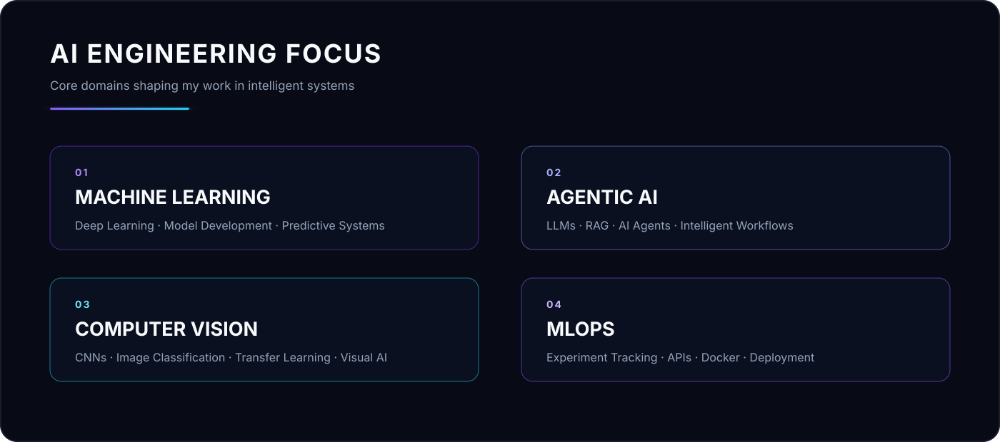

<!-- ============================ HERO ============================ -->

  

  

<!-- ========================== SOCIALS =========================== -->

&nbsp;

&nbsp;

 

<!-- ======================= AI FOCUS ======================== -->

 

 
