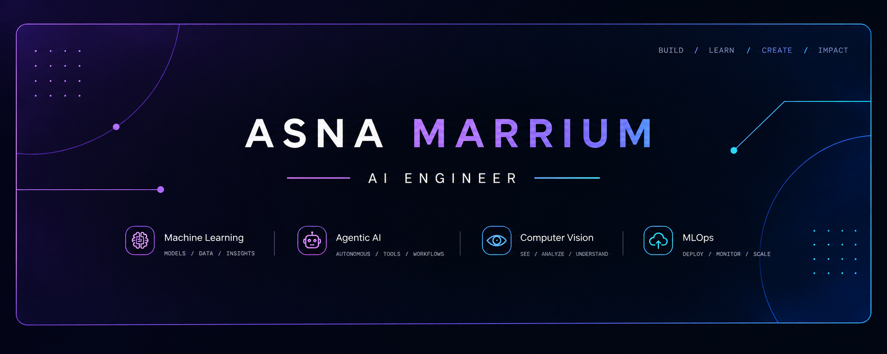

<!-- ============================ HERO ============================ -->

  

  

<!-- CONNECT BUTTONS -->

  
  &nbsp;
  
  &nbsp;
  

 

I'm an AI/ML Engineer focused on building intelligent systems that move beyond experimentation into practical, real-world applications. My work spans **Machine Learning, Computer Vision, Agentic AI and AI systems** with an interest in designing solutions that combine strong experimentation with thoughtful engineering and deployment. I enjoy working across the AI development lifecycle from exploring data and developing models to building intelligent workflows and turning ideas into reliable, usable systems.

- 🧠 **Exploring:** Intelligent & Agentic AI Systems
- 👁️ **Building with:** Machine Learning & Computer Vision
- ⚙️ **Focused on:** Practical AI Engineering & Deployment
- 🚀 **Goal:** Building AI solutions that create meaningful real-world impact

 

 

